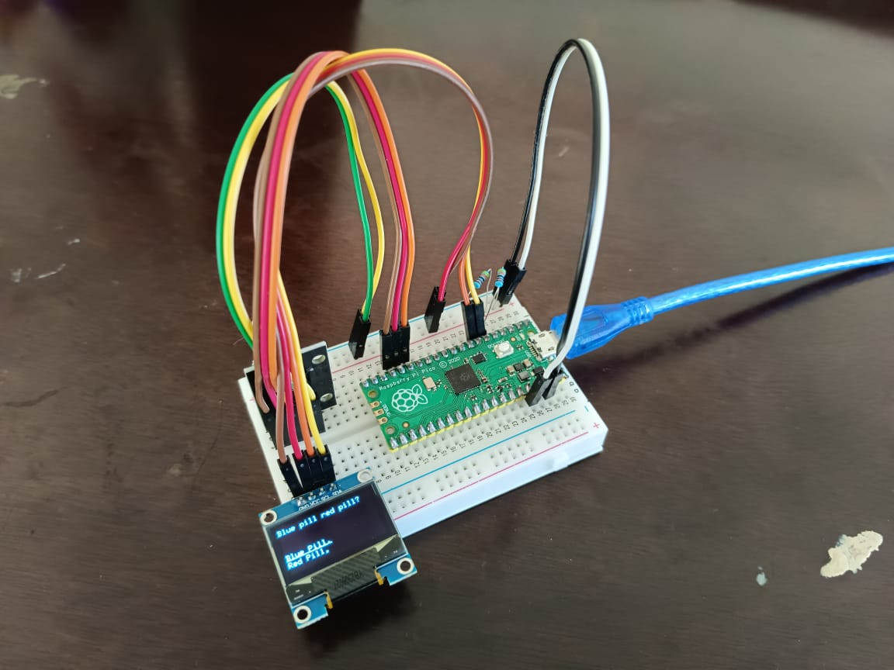

# Puirume: Code

As a continuation of [Puirume](https://github.com/rumelab/puirume_concept),
this is a simple Platform IO project that demonstrates the peripheral input and output as said in the aformentioned
document. It demonstrate a game, a simple blue pill red pill option selector, as shown in Figure 1.
It utilise [U8g2](https://github.com/olikraus/U8g2_Arduino#2.35.30) library for interfacing with SDD1306 OLED display,
[KY040](https://github.com/rumelab/ky040_library_code) library for interfacing with KY040 module,
and [State Machine](https://github.com/rumelab/state_machine_library_code) library for state management.

 \
_Figure 1: Puirume demonstration._
